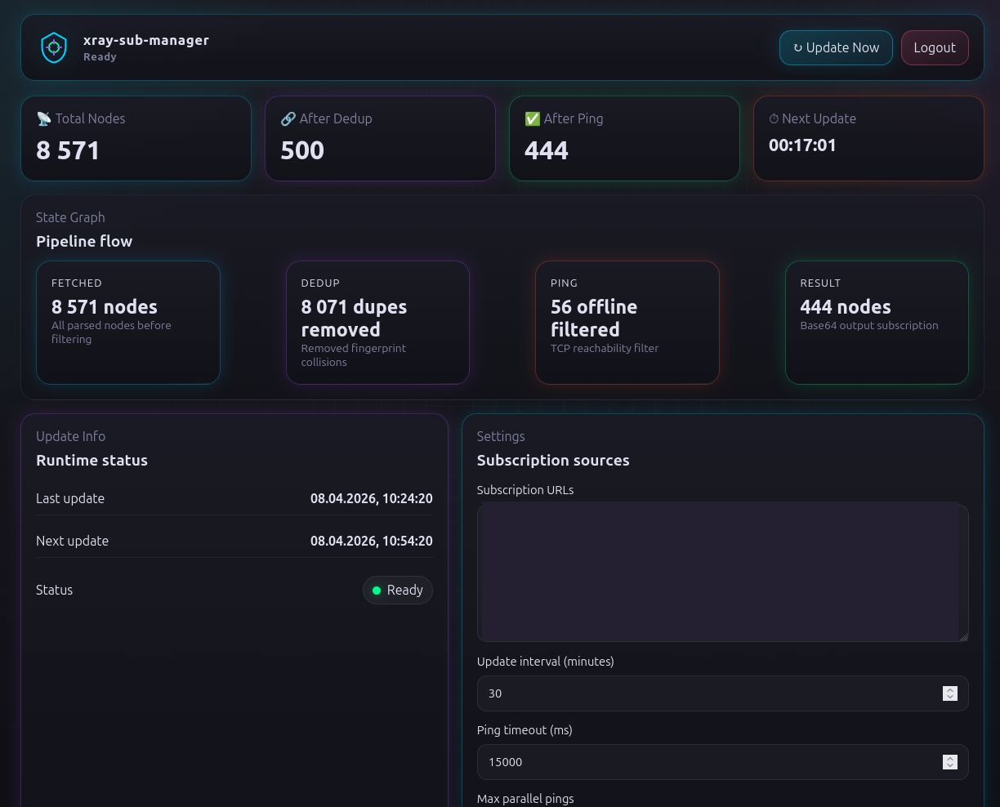

# xray-sub-manager

`xray-sub-manager` — сервис на Rust для загрузки Xray/V2Ray подписок, парсинга популярных форматов, дедупликации нод, проверки доступности через TCP connect, проверки тоннеля через `sing-box` и публикации итоговых подписок через веб-панель и `/sub`.

## Возможности

- Поддержка base64-списков URI, plaintext-списков, sing-box JSON и SIP008 JSON.
- Поддержка протоколов `vmess`, `vless`, `trojan`, `ss`, `ssr`, `hysteria2`, `tuic`.
- Несколько логических модемов в `config.json` через `modems[].modem_tag` и `modems[].modem_interface`.
- TCP ping каждой ноды выполняется отдельно через `SO_BINDTODEVICE` для интерфейса конкретного модема.
- White/gray health checks выполняются per-modem через `curl --interface <modem_interface>` отдельным частым scheduler-ом.
- Pipeline строит отдельную cache-ветку для каждого `modem_tag`; одинаковые `modem_interface` разрешены и считаются отдельными ветками.
- `/sub` умеет отдавать подписку одного модема или объединять cache-ветки всех модемов с per-modem распределением `limit`.
- Веб-интерфейс показывает modem-aware stats, health-индикацию, SVG fan-out граф и per-modem endpoint links.



## Запуск локально

```bash
cargo run --release
```

По умолчанию приложение использует конфиг:

```text
/opt/xray-sub-manager/config.json
```

Путь можно переопределить через `CONFIG_PATH` или аргумент командной строки:

```bash
CONFIG_PATH=/path/to/config.json cargo run --release
cargo run --release -- /path/to/config.json
```

Если конфиг отсутствует, приложение создаёт новый конфиг актуальной схемы и генерирует `admin_token` и `subscription_token`.

## Конфиг

Актуальный пример находится в `config.example.json`.

```json
{
  "schema_version": 1,
  "web_port": 8080,
  "admin_token": "change-me-admin-token",
  "subscription_token": "change-me-subscription-token",
  "update_interval_minutes": 60,
  "ping_timeout_ms": 3000,
  "max_concurrent_pings": 100,
  "max_concurrent_tunnels": 20,
  "network_check_interval_minutes": 10,
  "white_url": "https://www.gstatic.com/generate_204",
  "gray_url": "https://example.com",
  "subscription_urls": ["https://example.com/subscription.txt"],
  "modems": [
    { "modem_tag": "tele2", "modem_interface": "wwan0" },
    { "modem_tag": "mts", "modem_interface": "wwan1" }
  ]
}
```

Правила:

- `schema_version` должен соответствовать текущей схеме.
- `modem_tag` обязателен, уникален и может содержать только `A-Z`, `a-z`, `0-9`, `_`, `-`.
- `modem_interface` обязателен; дубли интерфейса разрешены.
- `network_check_interval_minutes` должен быть больше `0` и меньше `update_interval_minutes`.
- Runtime-статистика и health state не хранятся в `config.json`; они живут в памяти и в новом `subscription.cache`.

## Веб-панель

- Откройте `http://127.0.0.1:8080/`.
- Авторизуйтесь с помощью `admin_token` из `config.json`.
- Добавьте URL подписок и строки `modem_tag` + `modem_interface` в Settings.
- Сохраните настройки и запустите `Update Now`.
- Health checks запускаются сразу при старте и при изменении модемов, `white_url`, `gray_url` или интервала проверки.

## Эндпоинт подписки

Общая подписка по всем доступным cache-веткам:

```text
http://127.0.0.1:8080/sub?token=<subscription_token>
http://127.0.0.1:8080/sub?token=<subscription_token>&limit=5
```

Подписка конкретного модема:

```text
http://127.0.0.1:8080/sub?token=<subscription_token>&modem=tele2
http://127.0.0.1:8080/sub?token=<subscription_token>&limit=5&modem=tele2
```

Поведение `limit` без `modem`: сервис берёт до `ceil(limit / modem_count)` нод из каждой доступной cache-ветки в порядке `modems` из конфига, объединяет результат и обрезает общий список до `limit`.

Если cache ещё не сформирован, `/sub` вернёт `503 Service Unavailable`. Если `modem` неизвестен или для него нет cache-ветки, `/sub` вернёт `404 Not Found`.

## Установка как systemd-сервис

```bash
sudo ./install.sh
```

Скрипт установки для Ubuntu:

- устанавливает необходимые пакеты и `sing-box`;
- собирает release-бинарь;
- устанавливает бинарь в `/opt/xray-sub-manager/bin/xray-sub-manager`;
- создаёт конфиг по умолчанию в `/opt/xray-sub-manager/config.json`, если его ещё нет;
- создаёт и запускает `xray-sub-manager.service`;
- добавляет service capabilities `CAP_NET_RAW` и `CAP_NET_ADMIN`, необходимые для interface-bound сетевых операций на Linux.

## Структура файлов после установки

- Бинарь: `/opt/xray-sub-manager/bin/xray-sub-manager`
- Конфиг: `/opt/xray-sub-manager/config.json`
- Кеш подписки: `/opt/xray-sub-manager/subscription.cache`

## Примечания

- Interface-bound TCP ping использует Linux `SO_BINDTODEVICE` и может требовать capabilities/root privileges.
- DNS resolution выполняется до interface-bound TCP connect и использует системный resolver.
- Проверка white/gray URL зависит от установленного `curl` и выполняется строго через `curl --interface <modem_interface>`.
- Если `white_url` недоступен через модем, branch помечается как offline и не обновляет cache-ветку.
- Если `white_url` доступен, а `gray_url` недоступен, включается per-modem whitelist mode и tunnel checks повторяются через тот же `modem_interface`.
- Для проверки тоннелей должен быть доступен `sing-box`; путь можно переопределить через `SING_BOX_BIN`.
- URL для проверки тоннеля можно переопределить через `TUNNEL_PROBE_URL`.
- Уровень логов настраивается через `RUST_LOG`, например `RUST_LOG=info`.
